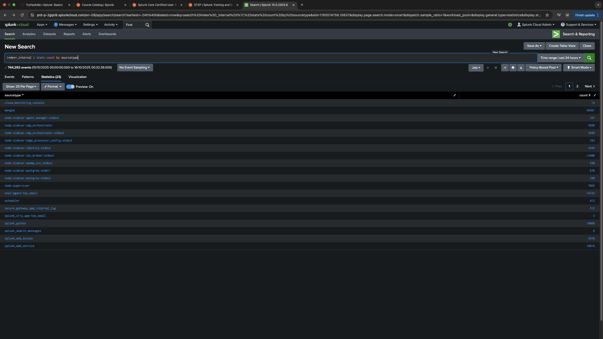
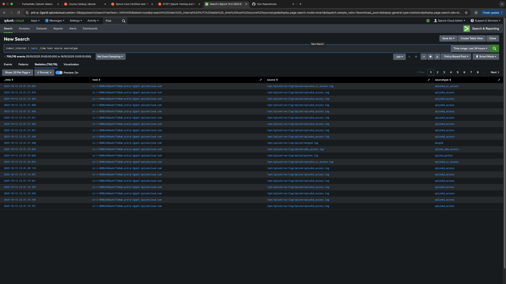
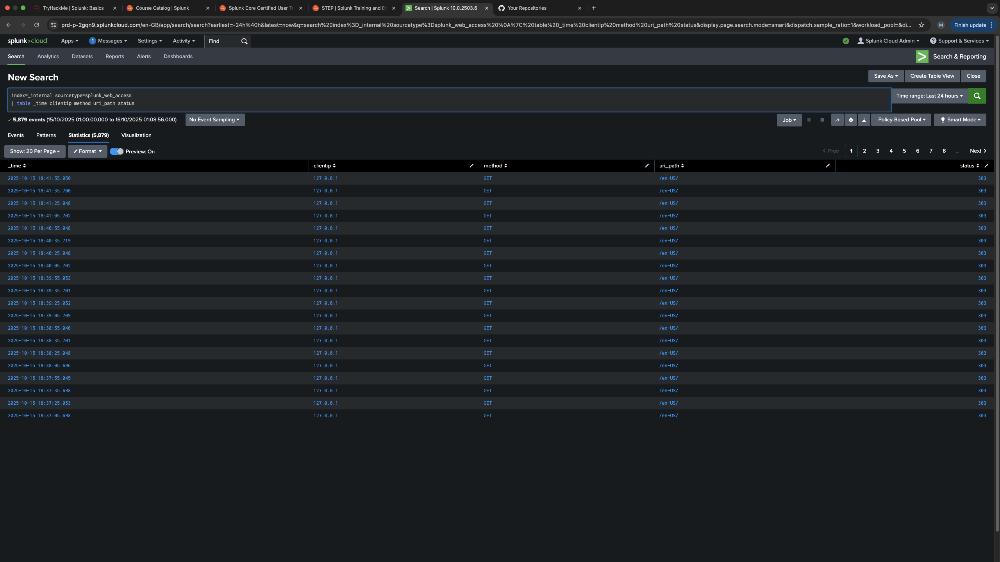
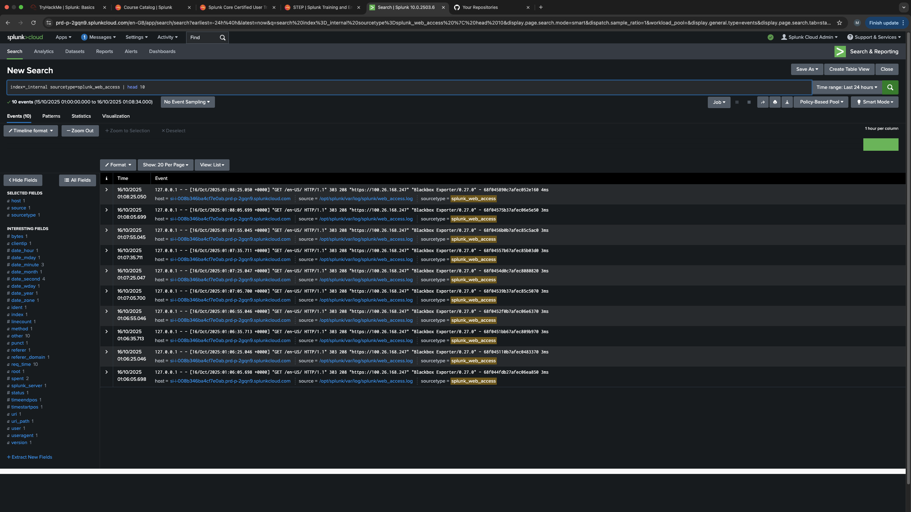

# 🧠 Lab 1 – Internal Index Exploration (Splunk Core User)

## 🎯 Objective  
Get hands-on experience exploring how Splunk stores and processes its own internal data.  
In this lab, I used the `_internal` index to understand **sourcetypes**, **metadata**, and **field extraction**.  
The goal was to get comfortable using basic Splunk search commands like `stats` and `table` — the same ones analysts use daily when investigating events.

---

## ⚙️ Environment  
- **Platform:** Splunk Cloud (Trial)  
- **Dataset:** Default internal Splunk logs (`index=_internal`)  
- **Time Range:** Last 24 hours  
- **Purpose:** Build familiarity with Splunk search syntax, automatic field extraction, and data exploration.

---

## 🧩 Commands Used & Outputs  

### 1️⃣ Count Events by Sourcetype  
```spl
index=_internal | stats count by sourcetype
```

**Purpose:**  
Displays how many events exist for each sourcetype within the `_internal` index.  
This helps identify what data Splunk is generating and ingesting internally.

**Output Example:**  


**Observation:**  
Several sourcetypes appear — including `splunk_web_access`, `splunkd`, `scheduler`, `metrics_log`, and others.  
Each represents a unique source of system telemetry inside Splunk.

---

### 2️⃣ Explore Event Metadata  
```spl
index=_internal | table _time host source sourcetype
```

**Purpose:**  
Display event metadata to understand what files and processes logs originate from.

**Output Example:**  


**Observation:**  
The table output shows how Splunk automatically includes metadata fields.  
Each log line is categorised by source and sourcetype, allowing analysts to easily filter and aggregate results.

---

### 3️⃣ Drill Deeper Into One Sourcetype  
```spl
index=_internal sourcetype=splunk_web_access | head 10
```

Then refine it for readability:  
```spl
index=_internal sourcetype=splunk_web_access | table _time clientip method uri_path status
```

**Purpose:**  
Investigate Splunk’s web access logs to view user interactions with the Splunk UI.

**Output Example:**  


**Observation:**  
- `clientip` values show `127.0.0.1` → local Splunk access.  
- `method` values are mostly `GET`.  
- `status = 303` indicates HTTP redirects (normal for Splunk login/UI navigation).

---

### 4️⃣ Raw Event View (Event Viewer)  
```spl
index=_internal sourcetype=splunk_web_access | head 10
```

**Purpose:**  
Inspect the raw log format to see the original data Splunk ingests.

**Output Example:**  


**Observation:**  
The `_raw` field shows complete log entries. Splunk auto-extracts key-value pairs (e.g. `clientip`, `uri_path`, `status`)  
and maps them into structured fields, enabling fast searching and filtering.

---

## 🔍 Findings  

| Sourcetype | Description | Example Source |
|-------------|--------------|----------------|
| `splunk_web_access` | Web UI access logs (requests to Splunk Web) | `/opt/splunk/var/log/splunk/splunkd_access.log` |
| `splunkd` | Core Splunk daemon logs | `/opt/splunk/var/log/splunk/splunkd.log` |
| `scheduler` | Tracks background jobs and alerts | `/opt/splunk/var/log/splunk/scheduler.log` |
| `metrics_log` | Internal performance and system metrics | `/opt/splunk/var/log/splunk/metrics.log` |
| `license_usage` | Licence monitoring data | `/opt/splunk/var/log/splunk/license_usage.log` |

---

## 🧠 Key Takeaways  
- The `_internal` index is Splunk’s self-monitoring system — a safe, built-in dataset for practising searches.  
- Each **sourcetype** represents a different data source, such as web access or daemon logs.  
- Splunk automatically **extracts fields** (e.g., `clientip`, `method`, `status`) from raw events.  
- The `table` command formats data for clarity, while `stats` aggregates event counts by field.  
- Understanding indexes and sourcetypes is essential before working with production datasets or security alerts.

---

## 📁 Repository Structure  
```
/Lab1-InternalIndexExploration
 ├─ README.md
 ├─ queries.txt
 ├─ notes.md
 ├─ screenshots/
 │   ├─ Screenshot_Lab1_StatsBySourcetype.png
 │   ├─ Screenshot_Lab1_EventMetadata.png
 │   ├─ Screenshot_Lab1_WebAccessTable.png
 │   ├─ Screenshot_Lab1_RawEventView.png
 └─ findings.csv (optional)
```

---

## 🏁 Reflection  
> This lab helped me understand how Splunk stores and categorises its own system logs.  
> Running the searches myself and seeing how fields like `sourcetype`, `source`, and `host` link together  
> gave me a clearer picture of how analysts navigate and investigate inside Splunk.  
> It’s a strong foundation before working with production or security log data,  
> and it built confidence in using Splunk’s core search syntax day-to-day.

